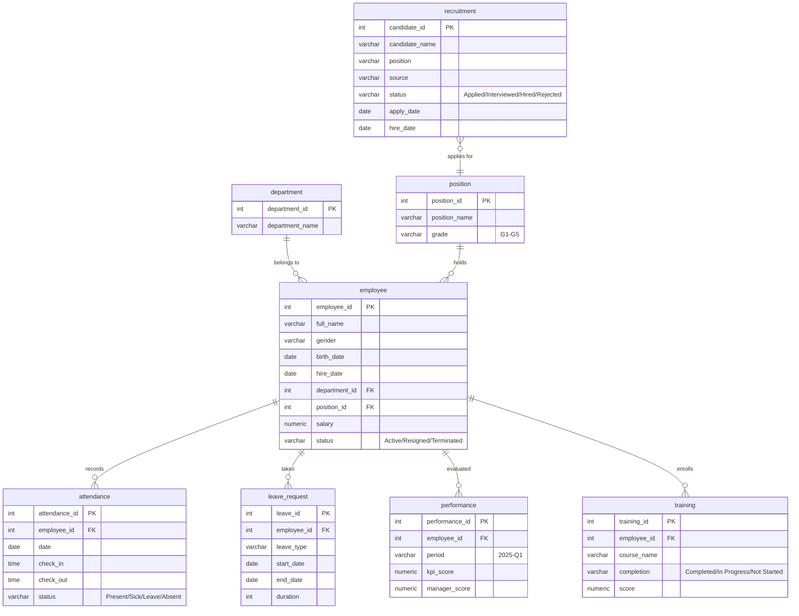
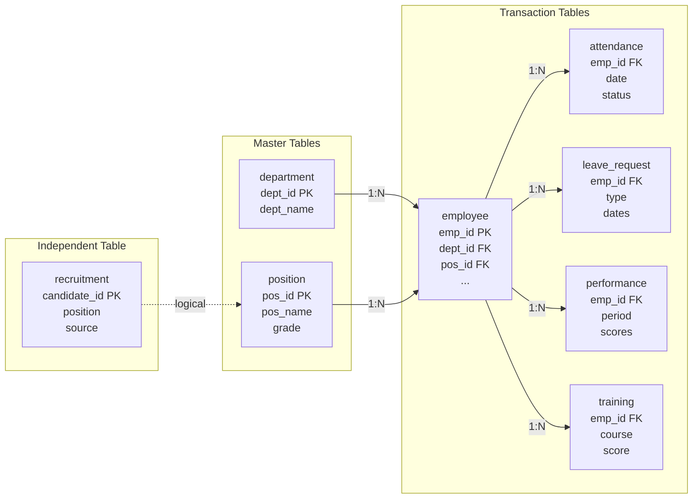
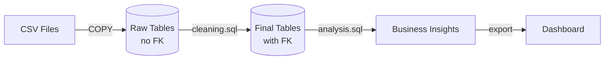

# Entity Relationship Diagram — HR Analytics System

```mermaid
erDiagram
    department ||--o{ employee : "belongs to"
    position ||--o{ employee : "holds"
    employee ||--o{ attendance : "records"
    employee ||--o{ leave_request : "takes"
    employee ||--o{ performance : "evaluated"
    employee ||--o{ training : "enrolls"
    recruitment }o--|| position : "applies for"

    department {
        int department_id PK
        varchar department_name
    }

    position {
        int position_id PK
        varchar position_name
        varchar grade "G1-G5"
    }

    employee {
        int employee_id PK
        varchar full_name
        varchar gender
        date birth_date
        date hire_date
        int department_id FK
        int position_id FK
        numeric salary
        varchar status "Active/Resigned/Terminated"
    }

    attendance {
        int attendance_id PK
        int employee_id FK
        date date
        time check_in
        time check_out
        varchar status "Present/Sick/Leave/Absent"
    }

    leave_request {
        int leave_id PK
        int employee_id FK
        varchar leave_type
        date start_date
        date end_date
        int duration
    }

    performance {
        int performance_id PK
        int employee_id FK
        varchar period "2025-Q1"
        numeric kpi_score
        numeric manager_score
    }

    recruitment {
        int candidate_id PK
        varchar candidate_name
        varchar position
        varchar source
        varchar status "Applied/Interviewed/Hired/Rejected"
        date apply_date
        date hire_date
    }

    training {
        int training_id PK
        int employee_id FK
        varchar course_name
        varchar completion "Completed/In Progress/Not Started"
        numeric score
    }
```

## Database Schema

```mermaid
flowchart LR
    subgraph Master["Master Tables"]
        D[department<br/>dept_id PK<br/>dept_name]
        P[position<br/>pos_id PK<br/>pos_name<br/>grade]
    end

    subgraph Transaction["Transaction Tables"]
        E[employee<br/>emp_id PK<br/>dept_id FK<br/>pos_id FK<br/>...]
        A[attendance<br/>emp_id FK<br/>date<br/>status]
        L[leave_request<br/>emp_id FK<br/>type<br/>dates]
        PF[performance<br/>emp_id FK<br/>period<br/>scores]
        T[training<br/>emp_id FK<br/>course<br/>score]
    end

    subgraph Independent["Independent Table"]
        R[recruitment<br/>candidate_id PK<br/>position<br/>source]
    end

    D -->|"1:N"| E
    P -->|"1:N"| E
    E -->|"1:N"| A
    E -->|"1:N"| L
    E -->|"1:N"| PF
    E -->|"1:N"| T
    R -.->|"logical"| P
```

## Data Flow

```mermaid
flowchart LR
    CSV[CSV Files] -->|COPY| RAW[(Raw Tables<br/>no FK)]
    RAW -->|cleaning.sql| FINAL[(Final Tables<br/>with FK)]
    FINAL -->|analysis.sql| INSIGHTS[Business Insights]
    INSIGHTS -->|export| DASH[Dashboard]
```
